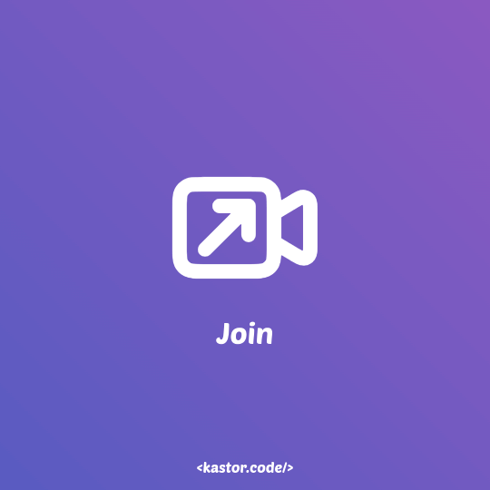
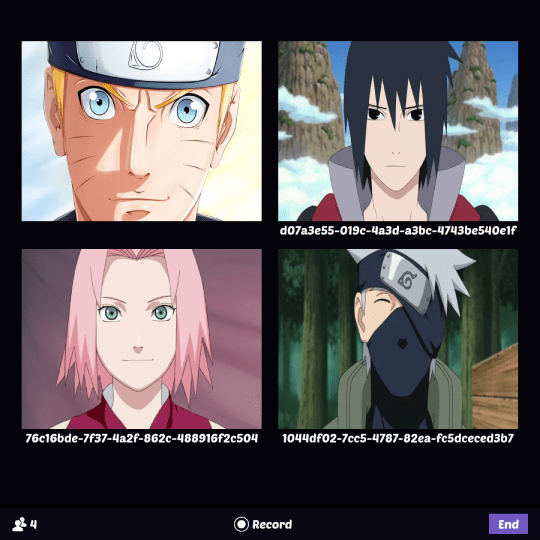

## JavaScript Video Conference with PeerServer and Socket.IO

> 👷 Developed by Matheus Ramalho de Oliveira  
🔨 Brazilian Software Engineer  
🏡 Goiânia, Goiás, Brasil  
✉️ kastorcode@gmail.com  
👍 [instagram.com/kastorcode](https://instagram.com/kastorcode)

---

  Full-stack project that allows the user to create video call rooms in real time, as well as record and download the generated videos. Communication with the server is in real time through the Socket.IO library, and video conferences are peer-to-peer through the PeerJS library. All responsibilities are very well distributed, in addition to the use of the Builder pattern.

---

### Screenshots

  
  

---

### Installation and execution

This project uses SSL, you need to have the `cert.pem` and `key.pem` files inside the `~/.ssl` folder.

PeerServer

1. Make a clone of this repository;
2. Open the 1-peer folder in a terminal;
3. Run `yarn` to install dependencies;
4. Run `yarn dev` to launch PeerServer at port `9000`.

Backend

1. Open the 2-backend folder in a terminal;
2. Run `yarn` to install dependencies;
3. Run `yarn dev` to launch it at port `3000`.

Frontend

1. Open the 3-frontend folder in a terminal;
2. Run `yarn` to install dependencies;
3. Run `yarn start` to launch http-server at `https://localhost:8080`.

---

  <big><b>&lt;kastor.code/&gt;</b></big>

